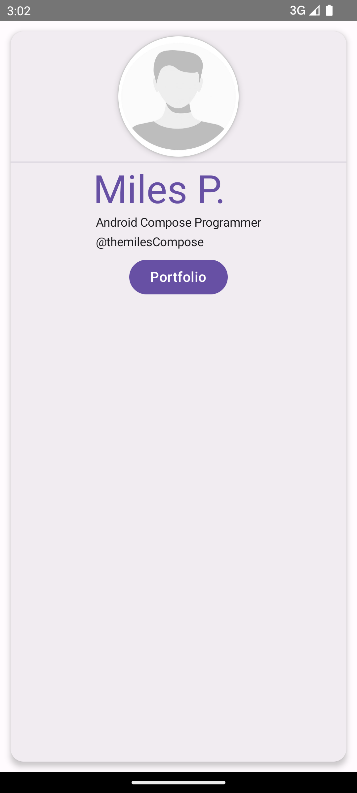
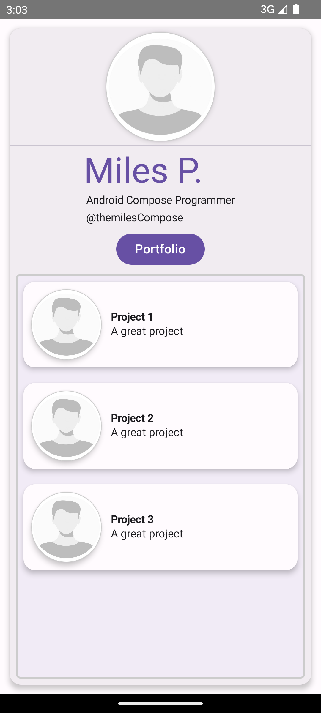
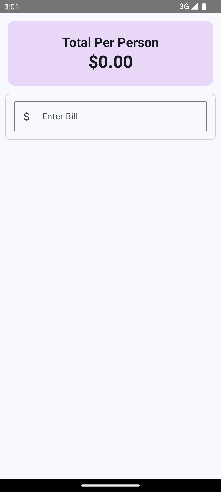
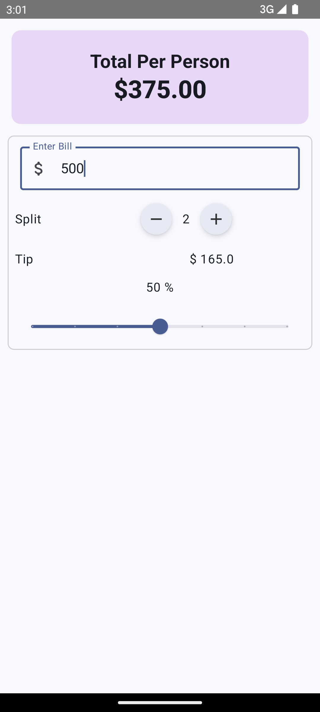
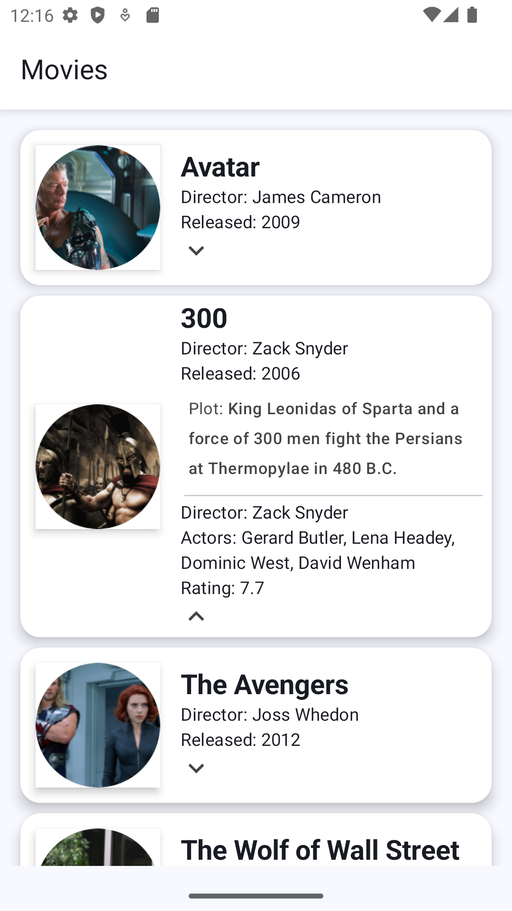
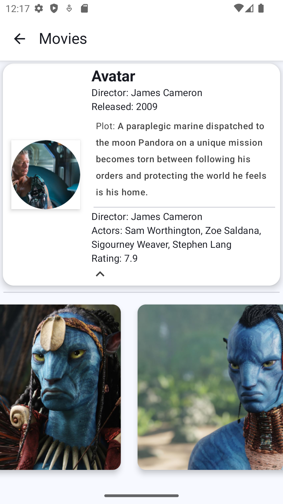
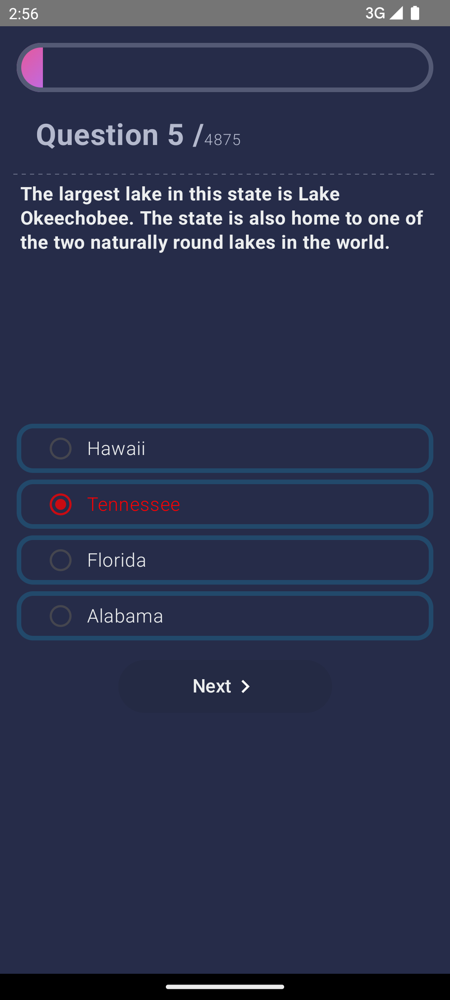
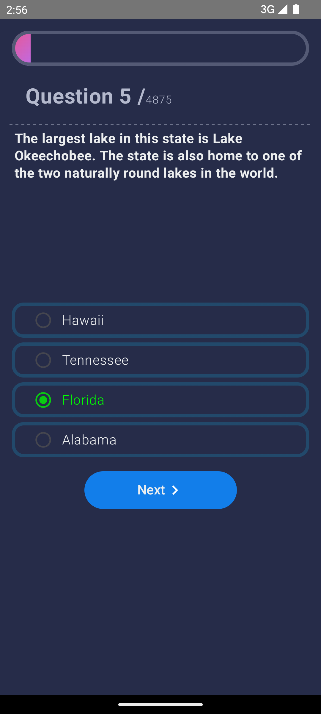

# 🚀 Kotlin Projects

This repository contains multiple projects built using **Kotlin** and **Jetpack Compose**.  
Each project is designed to demonstrate different UI components, architectural patterns, and best practices in Android development.

> 🛠️ **Note:** This repository is a work in progress and will continue to be updated over time.

---

## 📱 Projects Overview

---

## 1. Bizz Card App  
📇 A simple business card layout built using Jetpack Compose.

**Screenshots:**  

  
  

---

## 2. Jet Tip App  
💰 A tip calculator app that helps users split bills and calculate tips.

**Screenshots:**  

  
  

---

## 3. Movie App  
🎬 An app that showcases popular movies with a clean and modern UI.

**Screenshots:**  

  
  

---

## 4. Note App  
📝 A simple note-taking app built using Jetpack Compose.

**Screenshots:**  

  

---

## 5. Trivia App  
❓ A quiz/trivia app that fetches questions and tracks your score.

**Screenshots:**  

  
  

---

## 📬 Contact

Made with ❤️ by [Mehmet Ali SİVRİ](https://github.com/MehmetAliSivriDev)  
Feel free to open an issue or reach out if you have feedback or questions!
